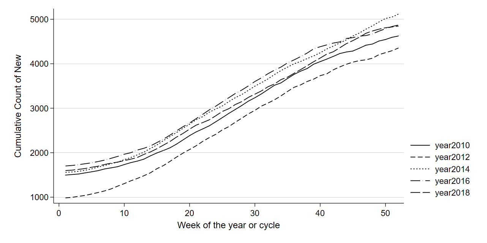

# Fictional total trends.
A project to generate and visualize fictional trends in total counts.

This project will provide tools designed to generate a dataset that can be used to create mock visualizations of weekly counts.

One example of live data visualized in this way would be to show [year by year cumulative counts of FAFSA fileings](https://web.education.wisc.edu/nwhillman/index.php/2017/01/04/high-school-fafsa-filing-trends/).

## Progress indicator

This project is under development. The following features / functions are planned.

- [ ] Write Algorithm base to generate fictional data.
- [ ] Add interactive features to algorithim allowing user to specify options such as "hourly, daily, weekly, or monthly."
- [ ] Generate base visualizations.
- [ ] Add ineractive options to the visualizations.

## Example output

## Other notes

